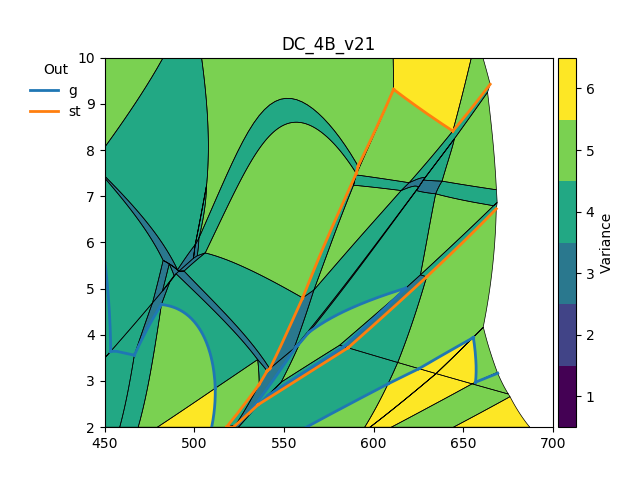
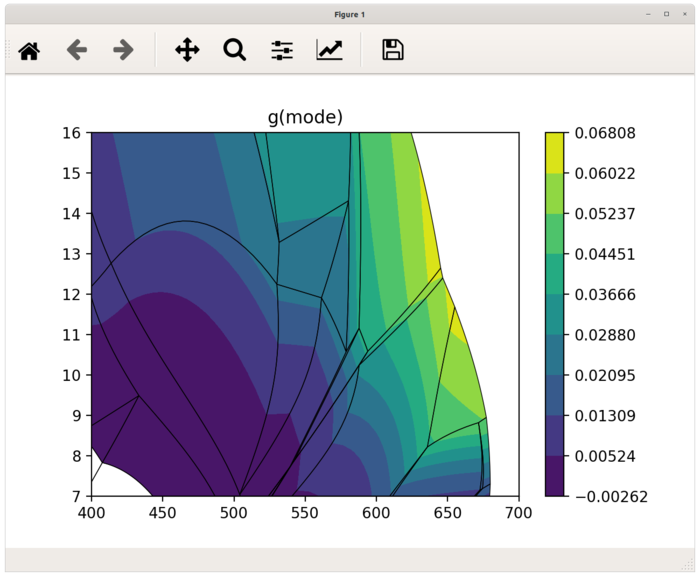
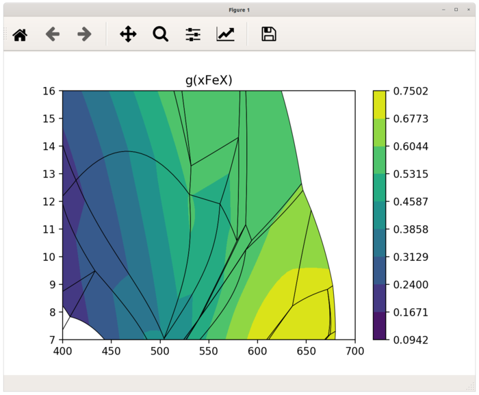
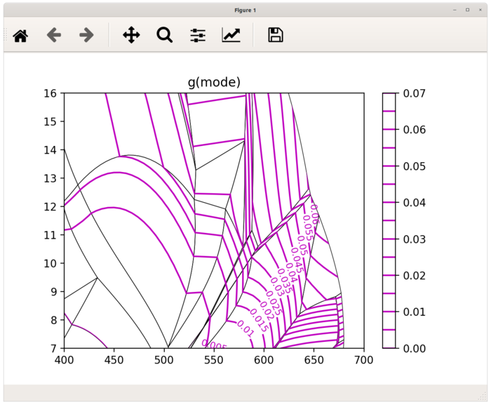
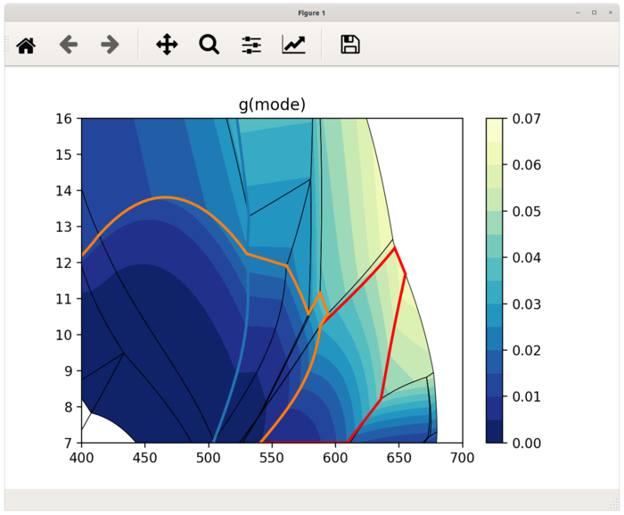

Command line scripts
====================

Before any further calculations you can check and draw your pseudosection using
`psshow` command which construct finished areas within your project. It has few
options to label pseudosection with assamblages or highlight out phase lines.

.. parsed-literal::

    $ psshow -h
    usage: psshow [-h] [-o OUT [OUT ...]] [-l] [--origwd] [-b] [--cmap CMAP]
              [--alpha ALPHA] [--connect] [--high HIGH]
              [--tolerance TOLERANCE]
              project [project ...]

    Draw pseudosection from project file

    positional arguments:
      project               builder project file(s)

    optional arguments:
      -h, --help            show this help message and exit
      -o OUT [OUT ...], --out OUT [OUT ...]
                            highlight out lines for given phases
      -l, --label           show area labels
      --origwd              use stored original working directory
      -b, --bulk            show bulk composition on figure
      --cmap CMAP           name of the colormap
      --alpha ALPHA         alpha of colormap
      --connect             whether mouse click echo stable assemblage
      --high HIGH           highlight field defined by set of phases
      --tolerance TOLERANCE
                            tolerance to simplify univariant lines

To draw pseudosection with marked epidote-out and chlorite-out
lines execute:

.. parsed-literal::

    $ psshow '/path/to/project.ptb' -o ep chl

Draw isopleths diagrams
-----------------------

To create isopleths diagrams the pseudoction should be gridded at first (In
other case only values from univariant lines and invariant points are used and
interpolated accross areas). Command `psgrid` will do all calculations and
result are saved afterwards, so next time results are automatically loaded. Be
aware that calculations takes some time.

.. parsed-literal::

    $ psgrid -h
    usage: psgrid [-h] [--nx NX] [--ny NY] [--origwd] [--tolerance TOLERANCE]
                  project [project ...]

    Calculate compositions in grid

    positional arguments:
      project               builder project file(s)

    optional arguments:
      -h, --help            show this help message and exit
      --nx NX               number of T steps
      --ny NY               number of P steps
      --origwd              use stored original working directory
      --tolerance TOLERANCE
                            tolerance to simplify univariant lines

For gridding pseudosection with grid 50x50 run following command:

.. parsed-literal::

    $ psgrid '/path/to/project.ptb' --nx 50 --ny 50
		Gridding: 100%|█████████████████████████████| 2500/2500 [01:30<00:00, 27.62it/s]
		Grid search done. 0 empty grid points left.

Once gridded you can draw isopleths diagrams using `psiso` command:

.. parsed-literal::

		$ psiso -h
    usage: psiso [-h] [-e EXPR] [-f] [--origwd] [-o OUT [OUT ...]] [--nosplit]
                 [-b] [--step STEP] [--ncont NCONT] [--colors COLORS]
                 [--cmap CMAP] [--smooth SMOOTH] [--labelkey LABELKEY]
                 [--high HIGH] [--tolerance TOLERANCE]
                 project [project ...] phase

    Draw isopleth diagrams

    positional arguments:
      project               builder project file(s)
      phase                 phase used for contouring

    optional arguments:
      -h, --help            show this help message and exit
      -e EXPR, --expr EXPR  expression evaluated to calculate values
      -f, --filled          filled contours
      --origwd              use stored original working directory
      -o OUT [OUT ...], --out OUT [OUT ...]
                            highlight out lines for given phases
      --nosplit             controls whether the underlying contour is removed or
                            not
      -b, --bulk            show bulk composition on figure
      --step STEP           contour step
      --ncont NCONT         number of contours
      --colors COLORS       color for all levels
      --cmap CMAP           name of the colormap
      --smooth SMOOTH       smoothness of the approximation
      --labelkey LABELKEY   label contours in field defined by set of phases
      --high HIGH           highlight field defined by set of phases
      --tolerance TOLERANCE
                            tolerance to simplify univariant lines

Following example shows isopleths of garnet mode:

.. parsed-literal::

    $ psiso '/path/to/project.ptb' -f g -e mode

If the *expression* argument is not provided, the ``psexplorer`` shows list of
all calculated variables available for given phase.

.. parsed-literal::

		$ psiso '/path/to/project.ptb' -f g
		Missing expression argument. Available variables for phase g are:
		mode x z m f xMgX xFeX xMnX xCaX xAlY xFe3Y H2O SiO2 Al2O3 CaO MgO FeO K2O
		Na2O TiO2 MnO O factor G H S V rho

To draw isopleths of almandine garnet proportion you can use expression from a-x
file `alm = x + (-m) x + (-x) z`:

.. parsed-literal::

    $ psiso '/path/to/project.ptb' -f g -e 'x-m*x-x*z'

or use variable `xFeX`:

.. parsed-literal::

		$ psiso tutorial.ptb -f g -e xFeX

If you need to label contour lines, you can use labelkey option to define field,
where contour labels are plotted.

.. parsed-literal::

    $ psiso '/path/to/project.ptb' g -e mode --labelkey "H2O bi g mu pa pl q ru"
		--step 0.005 --colors m

Another example of some other options.

.. parsed-literal::

    $ psiso tutorial.ptb -f g -e mode --step 0.005 --high "H2O bi g mu pa pl q ru"
    --out chl ep --cmap YlGnBu_r

