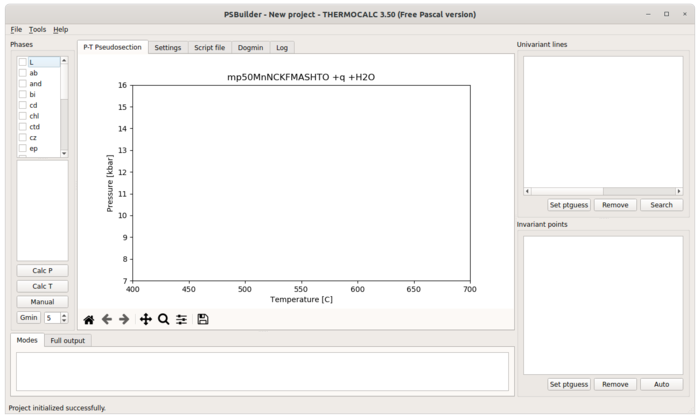
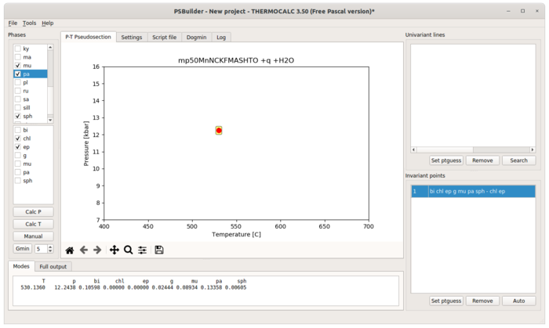
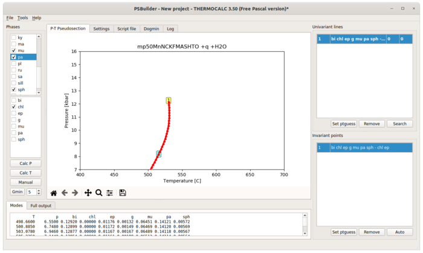
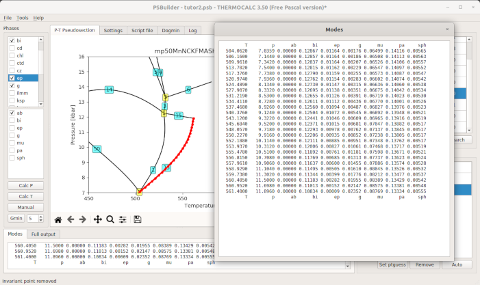
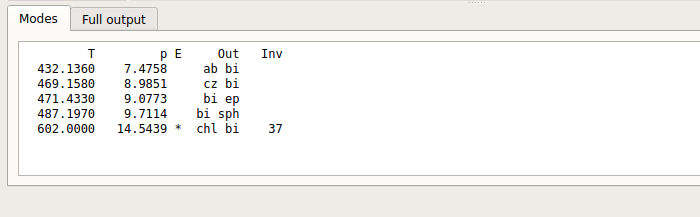
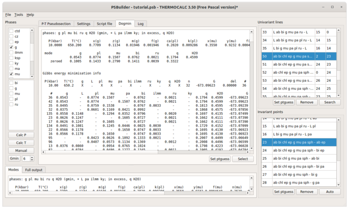
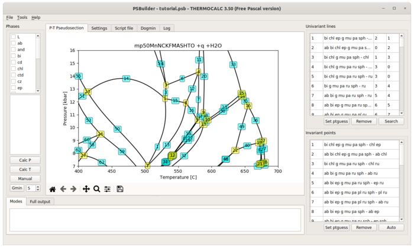
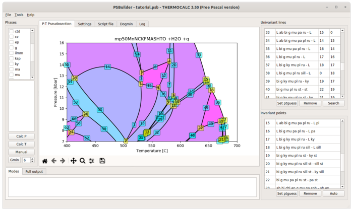
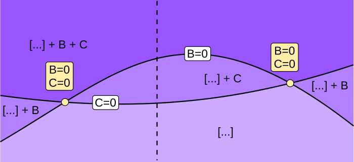

Pseudosection builders tutorial
===============================

The **pypsbuilder** provides three builders ``ptbuilder``, ``txbuilder`` and
``pxbuilder`` to create P-T, T-X and P-X pseudosections.

Before you can successfully run any builder, you have to prepare working
directory, which contain `THERMOCALC` and `drawpd` executables, preferences
file, thermodynamic dataset and a-x file. Builders will work only with certain
setting, like ``calcmode`` must be set to 1, no ask for scripts etc.
Builders validate settings and gives warning if some action is needed.

**The only special need is to place special tags for bulk composition, ptguesses
and dogmin in your scriptfile, to manage starting guesses and dogmin runs**.

You have to add following comment lines to your script file to line where
normally starting guesses should be placed (definitely before last `*` and
before standard or samecoding guesses).::

		%{PSBGUESS-BEGIN}
		%{PSBGUESS-END}

Scriptfile modifications for TC3.4
----------------------------------

For older version of THERMOCALC you need add two other commented blocks. For
dogmin replace existing ``dogmin`` script with::

		%{PSBDOGMIN-BEGIN}
		dogmin no
		%{PSBDOGMIN-END}

and for bulk composition place before and after existing ``setbulk`` script(s)
these tags::

		%{PSBBULK-BEGIN}
		setbulk ....
		%{PSBBULK-END}

Scriptfile modifications for TC3.5
----------------------------------

For latest THERMOCALC the tags are slightly different. You should enclosed calculation part as::

		%{PSBCALC-BEGIN}
		calcP 4 12
		calcT 600 1050 9
		calctatp no
		with  plc q aug hb sph g ep
		zeromodeisopleth g
		%{PSBCALC-END}

and for bulk composition place before and after existing ``bulk`` scripts
these tags::

		%{PSBBULK-BEGIN}
		bulk  H2O   SiO2   Al2O3 CaO    MgO    FeOt  K2O   Na2O  TiO2  O
		bulk  4.781 50.052 9.106 12.391 11.192 8.943 0.139 2.078 0.705 0.612
		%{PSBBULK-END}

If you are not sure, which scripts should be set on and off, you can check
example scriptfiles in ``examples/avgpelite`` or ``examples/avgpelite_34`` directory.

Using tcinit to setup working directory
---------------------------------------

For TC3.5 you can use ``tcinit`` script to initialize working directory.
It will download the latest 3.5 version of THERMOCALC, appropriate dataset
and a-x file according to user selection.

New P-T pseudosection project
-----------------------------

Use the terminal or an Anaconda Prompt, activate the ``pyps`` environment and
run ``ptbuilder``::

		$ conda activate pyps
		(pyps) $ ptbuilder

To create the new project (File->New project), you have to select working
directory. ``ptbuilder`` automatically execute `THERMOCALC`, check settings in your
script file and initialize project. Available phases are automatically
populated to `Phases` list and default P-T range from scriptfile is set.

Create invariant point
----------------------

In *Phases* list you select phases which should be in stable assemblage, while
in lower pane you select two phases for which modal proportion should be zero.
Than just click either ``Calc P`` or ``Calc T`` and invariant point will appear
on diagram and in the list of invariant points in lower right part of window.

Create univariant line
----------------------

Similarly, you can create univariant line, when only one phase is selected to
have zero modal proportion. In addition ``ptbuilder`` allows you to create
univariant lines based on already calculated invariant points. Right-click on
invariant points will show context menu with possible choices of univariant
lines passing trough this point and which are not yet calculated. Note, that
selecting offered univariant line phases from context menu, the starting guesses
from invariant point will be used in subsequent calculation. Hit **Calc T**
or **Calc P** according to dp/dT of univariant line. Once calculated, result is
added to diagram and to the list of univariant lines in upper right part of the
window. Within this list you can define begin and end by selecting appropriate
invariant points. If you allow autoconnection on `Settings` pane and both
invariants points are already calculated, the begin and end is set automatically.

By default, ``ptbuilder`` use 50 steps to calculate univariant lines. You can
change it in `Settings` pane. When you need to calculate some short univariant
lines you can zoom into this part of pseudosection and hit one of the ``Calc``
buttons. Active region (possibly extended, check *Extend view range to
calculation range* setting) will be used as computational P-T range. Moreover,
you can manually add univariant line to simply connect two invariant points by
straight line. For ''Manual'' addition of both invariant point or univariant
line present phases and zero mode phases have to be properly selected. Manually
added lines or points are shown in italics in lists. Unconnected univariant
lines are shown in bold.

When univariant line cannot be calculated by single THERMOCALC calculation
(either due to starting guesses or high curvature), you can merge partially
calculated segments using ''+'' button before calculation. Instead of overwriting
of existing line, newly calculated part will be merged with existing one. To
remove selected part of already calculated line, you can zoom to that part and
right-click highlighted name and choose ''Remove nodes''.

Double-clicking any univariant line or invariant point in the list will
highlight that line/point on diagram marked by calculated points.

.. highlights::

   Note that double-click name of univariant (or invariant) line will populate
   `Modes` and `Full output` panes at the bottom of application, so you can
   always check what is going on along lines. Double-clicking of tabs heading
   open outputs in larger separate window.

Starting guesses
----------------

``ptbuilder`` stores all relevant information for each point or line already
calculated. If you need to update starting guesses during construction of
pseudosection, just choose invariant point or univariant line from which the
starting guesses should be copied and click ``Set ptguess`` button.
``ptbuilder`` stores new starting guesses to your script file, so next
calculation will use it. You can any time check and/or modify your script file
with integrated editor on `Script file` pane. The `Log` pane always shows
standard output of last `THERMOCALC` execution.

Phase out and phase stable lines
--------------------------------

Double click on any phase in *Phases* list will highlight all univariant lines
with zero modal proportion of selected phase and all phase present univariant
lines.

.. image:: images/psbuilder_highlight.png

Manual invariant points or univariant lines
-------------------------------------------

``Manual`` button allows to add user-defined point or line. You need to select
stable phases and zero mode phases accordingly. For manual univariant line
begin and end invariant point must be specified. For manual invariant point, you
can either specify position of point by clicking on diagram by mouse or when
more than two univariant lines passing trough that point already exists,
calculated intersection could be used.

Searching for invariant points
------------------------------

To find out, what phase is appearing or disappearing along exiting univariant
line, you can activate that line and click the ``Search`` button. Builder list
possible (only found ones, if ptguesses are not appropriate, only metastable
invariant points could be offered) solutions ordered along univariant line
direction. The already calculated invariant points are marked. If there is
one already calculated invariant point, the ptguesses from that point are used.

Dogmin
------

``Gmin`` button runs THERMOCALC dogmin script, which tries to calculate phase
equilibria between all possible subsets of a list of selected phases. The
pressure and temperature is indicated by clicking on the diagram. Maximum
variance to be considered (higher max variance -> fewer phases in smallest
assemblage) is set in spin widget next to ``Gmin`` button. Ranked the equilibria
in order of stability by comparing the Gibbs energies of each assemblage are
shown in *Modes* pane.  On *Dogmin* pane you can use ``Select`` button to select
found assemblage in *Phases* and ``Set guesses`` to use ptguess of found
solution.

Finished pseudosection should contain topologically correct set of univariant
lines and invariant points. Topology could be checked by creating areas
(Tools>Show areas or Ctrl-A) of stable assemblages. If there are some topological
or geometrical problems to create areas, corresponding IDs are reported on
''Mode'' tab.

Double crossing univariant lines
--------------------------------

Common problem is that you realize during construction of pseudosection, that
some univariant lines are double crossing and therefore two invariant points
and two separated segments of univariant lines with identical assemblage and
zero mode phase(s) exists. The **pypsbuilders** cannot have those "identical"
points and lines in single project an pseudosection has be split in two
parts by defining axes limits on `Settings` pane. Split line should be
placed approximately like on the figure.

The all parts of single pseudosection could be post-processed and visualized
by **psexplorers** simulataneously as single pseudosection.

When you have already calculated invariant points and lines and you want to use
them in separate project, create new project, set axes limits properly and
use `File>Import > Import into range` to read it.

T-X and P-X pseudosections
--------------------------

You can create T-X and P-X pseudosection using exactly same steps like for
