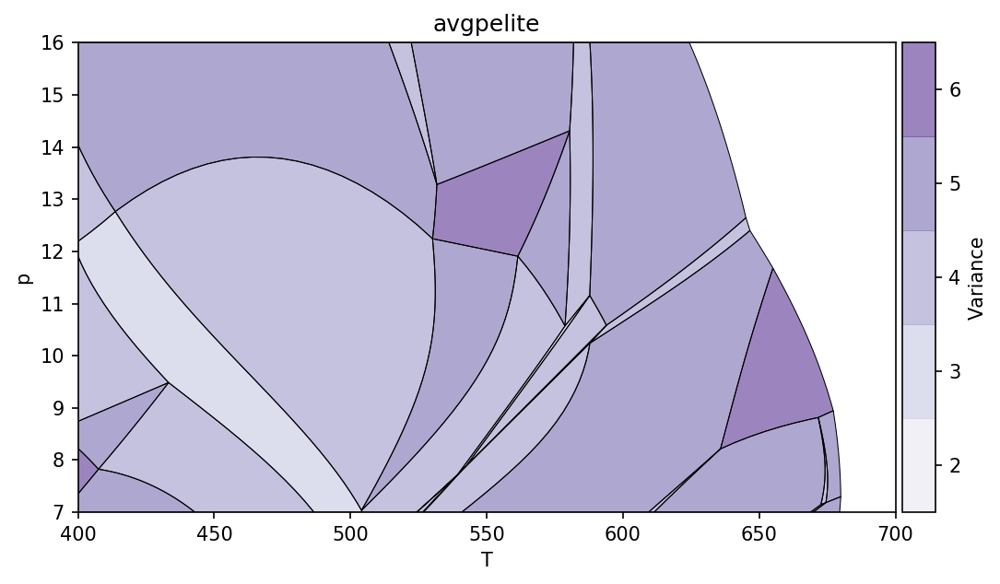
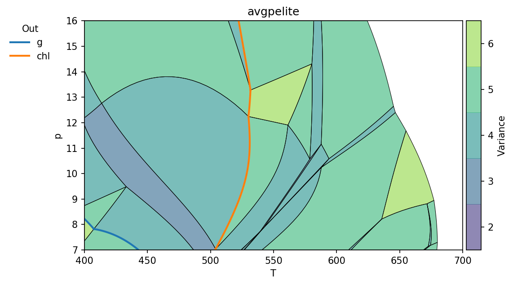
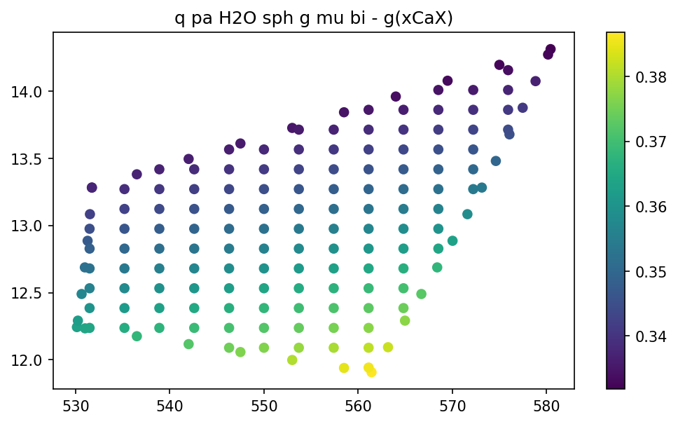
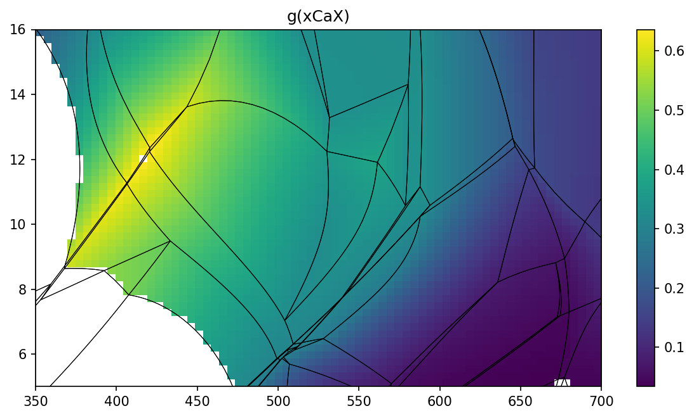
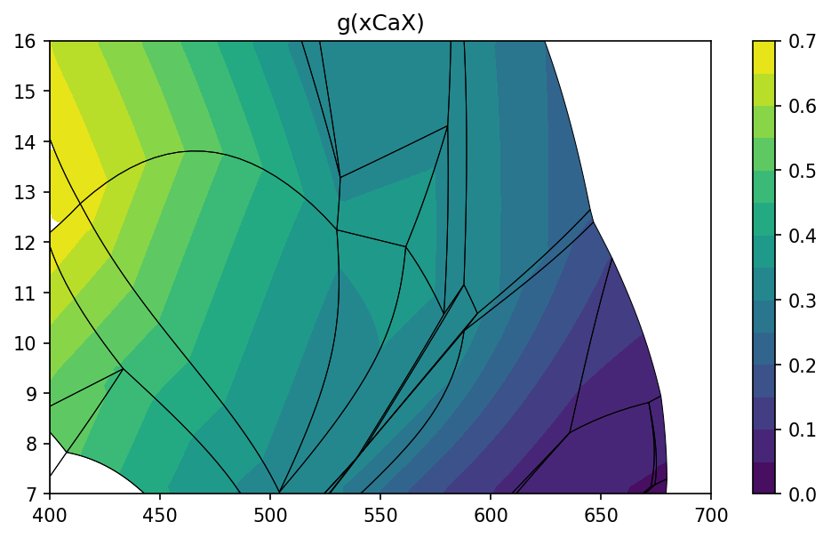
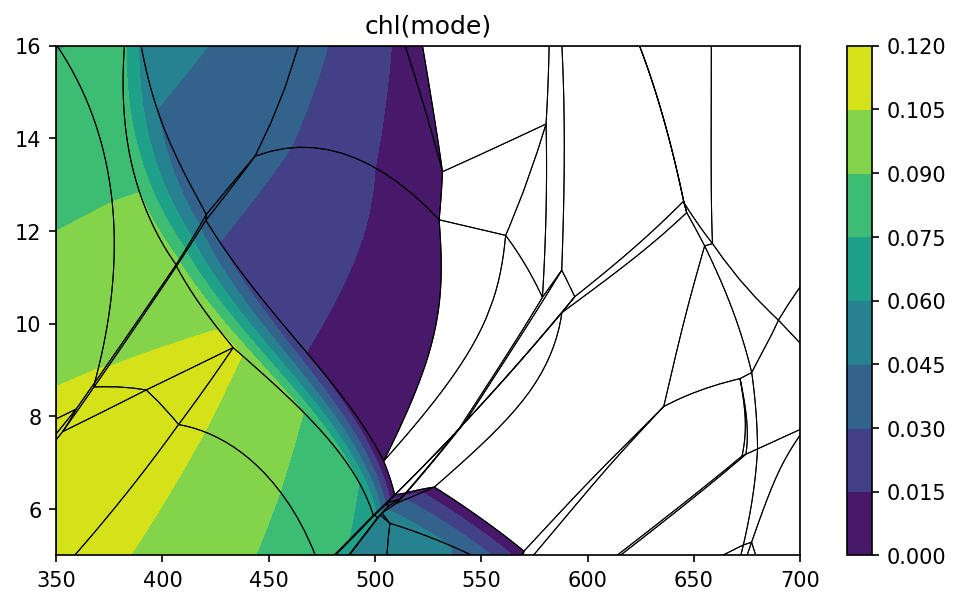
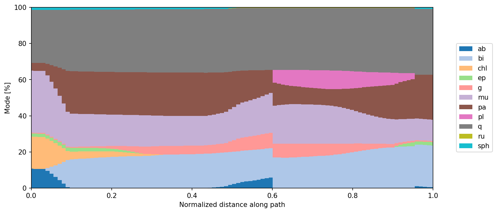
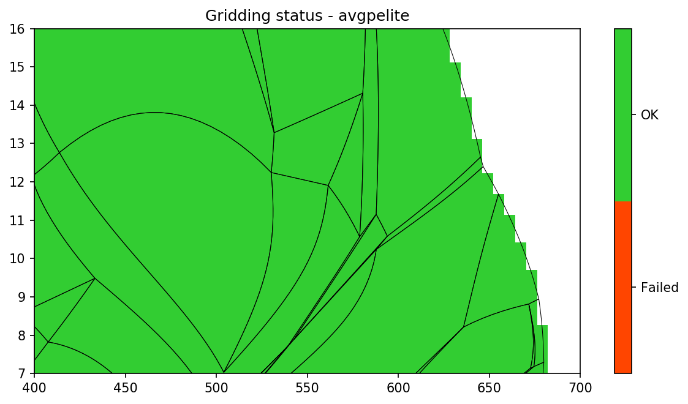
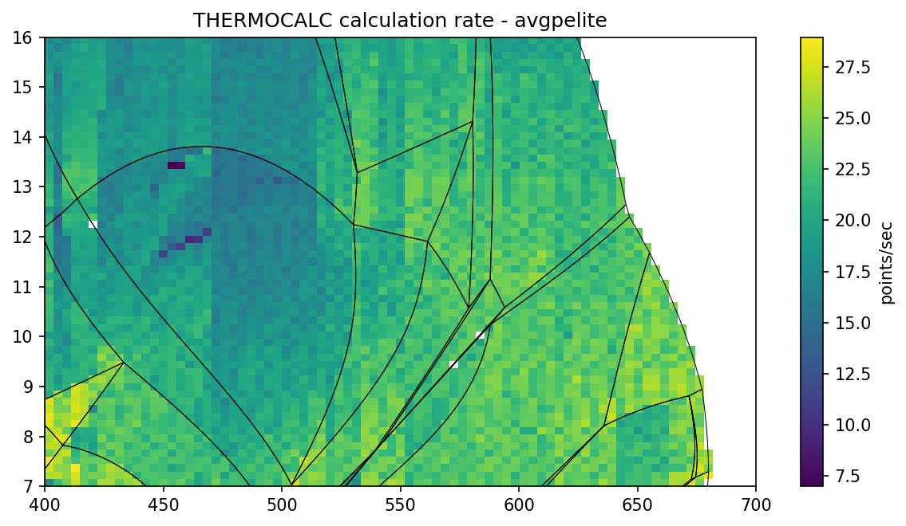

Pseudosection explorers tutorial
================================

**psexplorers** provides several post-processing methods and visualizations of
already constructed pseudosections. You can also create isopleths diagrams or do
calculations along paths.

It provides four command-line scipts `psgrid`, `psshow` and
`psiso` for quick visualizations. For options, check built-in help, e.g.::

    $ psshow -h

To show pseudosection, you need to provide project file::

    $ psshow -b /some/path/project.ptb

Using psexplorers in Python (or Jupyter notebook)
-------------------------------------------------

To access all options of **psexplorer** it is suggested to use Python API. You
need to activate the pyps environment and run python interpreter::

    $ conda activate pyps
    $ python

To use **psexplorer** we need to import appropriate class, which contains most
of the methods to work with pseudosection.

  - ``PTPS`` class for P-T pseudosection constructed with ``ptbuilder``
  - ``TXPS`` class for T-X pseudosection constructed with ``txbuilder``
  - ``PXPS`` class for P-X pseudosection constructed with ``pxbuilder``

All following commands must be executed in Python interpreter.

.. code:: python

    from pypsbuilder import PTPS

The second step is to create instance of pseudosection using existing project file.

.. code:: python

    pt = PTPS('/some/path/project.ptb')

We can check, whether the pseudosection already contains gridded
calculations. If not, we can use ``calculate_composition`` method to
calculate compositional variations on grid. The resulting data are stored in
project file. Note that any new modifications of the project by *pypsbuilder**
will discard compositional variations on grid and must be calculated again.

.. code:: python

    if not pt.gridded:
        pt.calculate_composition(nx=50, ny=50)

.. parsed-literal::

    Gridding 1/1: 100%|██████████| 2500/2500 [03:10<00:00, 13.12it/s]
    Grid search done. 0 empty points left.

Visualize pseudosection
-----------------------

To show pseudosection, we can use ``show`` method

.. code:: python

    pt.show()

The keyword arguments ``cmap`` and ``out`` could be used to modify colormap and
highlight zero mode lines across pseudosection.

.. code:: python

    pt.show(cmap='viridis', out=['g', 'chl', 'ep', 'law'])

The keyword arguments ``bulk`` and ``label`` set whether the bulk composition
is shown on figure and whether the fields are labeled by phases.

.. code:: python

    pt.show(cmap='viridis', bulk=True, label=True)

.. image:: images/show_label.png

The pseudosection ``identify`` method could be used to identify stable assemblage for
given *p* and *T* conditions. Note that returned key (Python frozenset) is used
to identify stable assemblage in many ``PTPS`` methods.

.. code:: python

    key = pt.identify(550, 13)
    print(key)

.. parsed-literal::

    frozenset({'sph', 'pa', 'q', 'g', 'mu', 'H2O', 'bi'})

Access data and variables stored in project
-------------------------------------------

The calculated data are usually accessed using stable assemblage key (see above).
Theera are three groups of data stored 1) at invariant points, 2) along univariant
lines and 3) on grid covering multivariate fields. To see data coverage and all
available variables, you can use ``show_data`` method. When no variable (or expression)
is provided, method will show available variables.

.. code:: python

    pt.show_data(key, 'g')

.. parsed-literal::

    Missing expression argument. Available variables for phase g are:
    mode x z m f xMgX xFeX xMnX xCaX xAlY xFe3Y H2O SiO2 Al2O3 CaO MgO FeO K2O Na2O TiO2 MnO O factor G H S V rho
    Available end-members for g: kho gr alm py spss

Once variable is provided, the all available data are shown.

.. code:: python

    pt.show_data(key, 'g', 'xCaX')

For data on the grid you can visualize them for all diagram in once using
``show_grid`` method.

.. code:: python

    pt.show_grid('g', 'xCaX')

To create isopleths diagram you can use ``isopleths`` method. Note that
contours are created separately for each stable assemblage allowing
proper geometry of isopleths.

.. code:: python

    pt.isopleths('g', 'xCaX', N=14)

.. code:: python

    pt.isopleths('chl')

.. parsed-literal::

    Missing expression argument. Available variables for phase chl are:
    mode x y f m QAl Q1 Q4 xMgM1 xMnM1 xFeM1 xAlM1 xMgM23 xMnM23 xFeM23 xMgM4 xFeM4 xFe3M4 xAlM4 xSiT2 xAlT2 H2O SiO2 Al2O3 CaO MgO FeO K2O Na2O TiO2 MnO O factor G H S V rho
    Available end-members for chl: ames mmchl ochl1 f3clin afchl ochl4 clin daph

.. code:: python

    pt.isopleths('chl', 'mode')

Calculations along PT paths
---------------------------

``PTPS`` allows you to evaluate equilibria along user-defined PT
path. PT path is defined by series of points (path is interpolated) and
method ``collect_ptpath`` do actual calculations. It runs THERMOCALC
with ptguesses obtained from existing calculations.

.. code:: python

    t = [380, 480, 580, 640, 500]
    p = [7, 12, 15, 9, 5.5]
    pa = pt.collect_ptpath(t, p)

.. parsed-literal::

    Calculating: 100%|██████████| 100/100 [00:03<00:00, 25.86it/s]

You can see phase modes along PT path using ``show_path_modes`` method.

.. code:: python

    pt.show_path_modes(pa, exclude=['H2O'])

or show value of user-defined expression shown as colored strip on PT
space.

.. code:: python

    pt.show_path_data(pa, 'g', 'mode')

.. image:: images/ptpath.png

Extra
-----

``show_status`` method shows status of calculations on the grid.
Possible failed calculations are shown.

.. code:: python

    pt.show_status()

Do you want to know execution time of THERMOCALC on individual grid
points? Check ``show_delta`` method.

.. code:: python

    pt.show_delta(pointsec=True)

**For full description of Python API check:** :doc:`api`.
