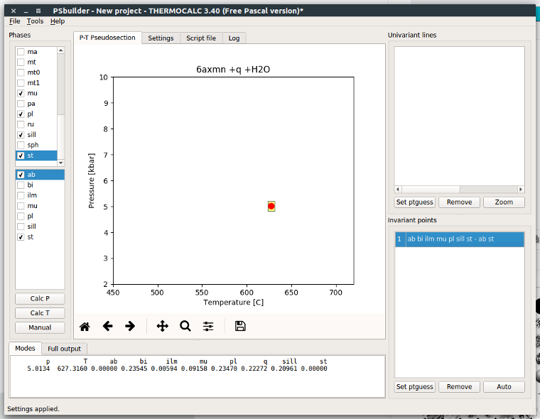
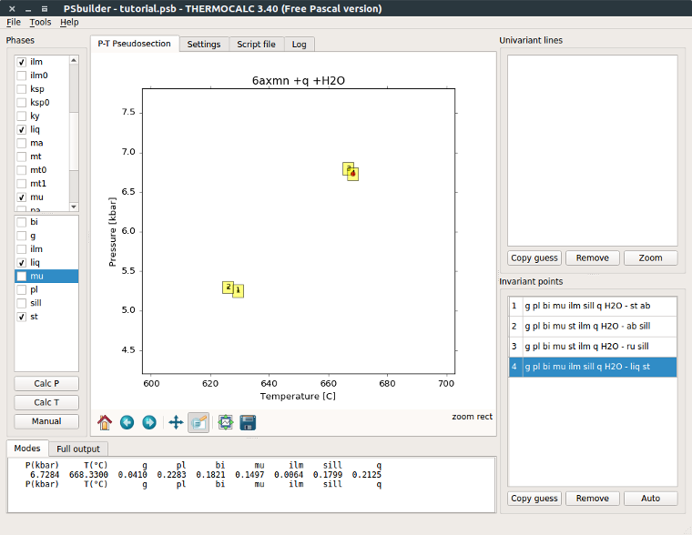
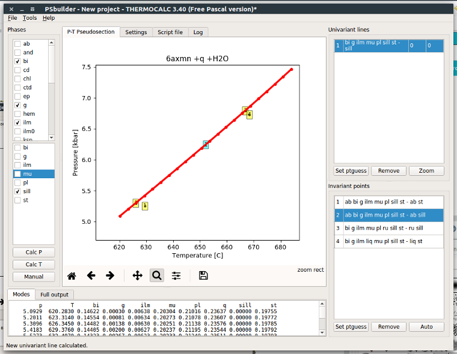
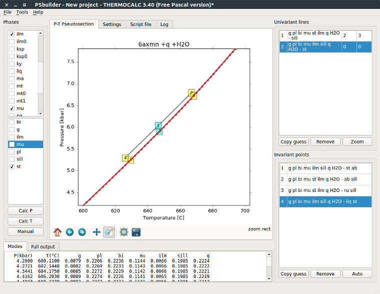
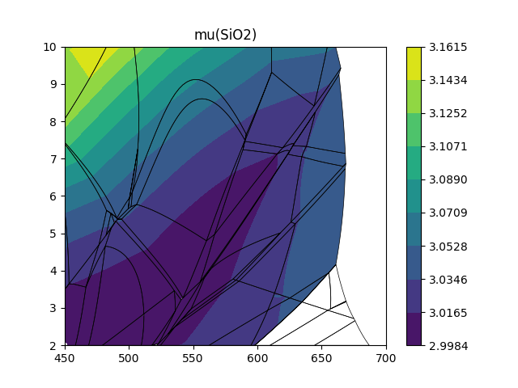
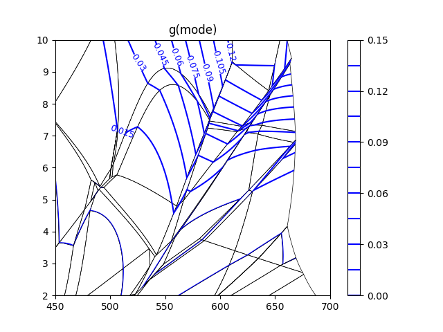

PSbuilder tutorial
==================

Before you can successfully run PSbuilder you have to prepare working directory,
which contain `THERMOCALC 3.40` and `Drawpd 1.16` executables, preferences file,
thermodynamic dataset and a-x file. PSbuilder will work only with certain setting,
like calcmode must be 1, setexcess keyword have to be present to skip question,
calctatp have to be ask etc. PSbuilder check for right settings and gives warning
if some action is needed.

**The only special need is to place ptguess tags in your script file,
to allow PSbuilder manage starting guesses**. Just insert following comment lines to your script file
to line where normally starting guesses should be placed (definitely before last `*`).::

    %{PSBGUESS-BEGIN}
    %{PSBGUESS-END}

If you are nor sure, what scripts should be set on and off, you can download sample
working directory or download preferences and user files from Richard's White
`Dataset 6 web page <http://www.metamorph.geo.uni-mainz.de/thermocalc/dataset6/index.html>`_.

New project
-----------

When you create new project (File->New project), you have to select prepared working directory.
PSbuilder automatically execute `THERMOCALC`, check settings in your script file and initialize
project. Available phases are automatically populated to `Phases` list and default P-T range is set.

.. image:: images/psbuilder_init.png

Create invariant point
----------------------

In `Phases` list you select phases which occurs within your field, while in lower pane you
select two phases for which modal proportion should be zero. Than just click **Calc P** or **Calc T** and
invariant point will appear on diagram and in the list of invariant points in lower right part of window.

Create univariant line
----------------------

Similarly, you can create univariant line, when only one phase is selected to have zero modal
proportion. In addition PSbuilder allows you to create univariant lines based on already calculated
invariant points. Right-click on invariant points will show context menu with possible choices of univariant
lines passing trough this point and which are not yet calculated. Hit **Calc T** or **Calc P** according
to dp/dT of univariant line. Once calculated, result is added to diagram and to the list of univariant
lines in upper right part of the window. Within this list you can define begin and end by selecting
appropriate invariant points.

By default, PSbuilder use 50 steps to calculate univariant lines. You can change it in `Settings` pane.
When you need to calculate some short univariant lines you can zoom into this part of pseudosection
and hit **Calc** button. Active region will be used as computational P-T range. Moreover, you can manually
add univariant line to simply connect two invariant points by straight line. For **Manual** addition
of both invariant point or univariant line phases and zero modal proportion phase have to be properly selected.
Manually added lines or points are shown in bold in lists.

Double-clicking any univariant line in the list will highlight that line on diagram marked by
calculated points.

.. highlights::

   Note that double-click name of univariant (or invariant) line will populate `Modes` and
   `Full output` panes at the bottom of application, so you can always check what is going on along lines. Double-clicking of tabs heading open outputs
   in separate window.

.. image:: images/psbuilder_finished.png

Starting guesses
----------------

PSbuilder store all relevant informations for each point or line already calculated. If you need to update starting
guesses during construction of pseudosection, just choose invariant point or univariant line from which the starting
guesses should be copied and hit **Set ptguess** button. PSbuilder store new starting guesses to tagged part of your
script file, so nect calculation will use them. You can any time check and/or modify your script file with
integrated editor on `Script file` pane. The `Log` pane always shows standard output of last `THERMOCALC` execution.

Phase out lines
---------------

Double click on any phase in `Phases` list will highlight all univariant lines with zero modal proportion of
selected phase.

PSexplorer tutorial
===================

PSexplorer allows you visualize finalized pseudosection, create isopleth diagrams or generate `drawpd` file.
It provides four command line scipts `psgrid`, `psdrawpd`, `psshow` and `psiso`.

Draw pseudosections
-------------------

Before any further calculations you can check and draw your pseudosection using `psshow` command which construct
finished areas within your project. It has few options to label pseudosection with assamblages or highlight out
phase lines.::

    psshow -h
    usage: psshow [-h] [-o OUT [OUT ...]] [-l] project

    Draw pseudosection from project file

    positional arguments:
      project               psbuilder project file

    optional arguments:
      -h, --help            show this help message and exit
      -o OUT [OUT ...], --out OUT [OUT ...]
                            highlight out lines for given phases
      -l, --label           show alrea labels

For example, to draw pseudosection with marked garnet-out and staurolite-out lines execute::

    psshow '/path/to/project.psb' -o g st

.. image:: images/psshow_out.png

Draw isopleths diagrams
-----------------------

To create isopleths diagrams the pseudoction should be gridded at first (In other case only values from univariant
lines and invariant points are used and interpolated accross areas). Command `psgrid` will do all calculations
and result are saved afterwards, so next time results are automatically loaded. Be aware that calculations takes
some time.::

    usage: psgrid [-h] [--numT NUMT] [--numP NUMP] project

    Calculate compositions in grid

    positional arguments:
      project      psbuilder project file

    optional arguments:
      -h, --help   show this help message and exit
      --numT NUMT  number of T steps
      --numP NUMP  number of P steps

For gridding pseudosection with grid 120x100 run following command::

    psgrid '/path/to/project.psb' --numT 120 --numP 100

Once gridded you can draw isopleths diagrams using `psiso` command::

    usage: psiso [-h] [-f] [--step STEP] [--ncont NCONT]
                 [--colors COLORS] [--cmap CMAP] [--smooth SMOOTH]
                 [--clabel CLABEL [CLABEL ...]]
                 project phase expr

    Draw isopleth diagrams

    positional arguments:
      project               psbuilder project file
      phase                 phase used for contouring
      expr                  expression evaluated to calculate values

    optional arguments:
      -h, --help            show this help message and exit
      -f, --filled          filled contours
      --step STEP           contour step
      --ncont NCONT         number of contours
      --colors COLORS       color for all levels
      --cmap CMAP           name of the colormap
      --smooth SMOOTH       smoothness of the approximation
      --clabel CLABEL [CLABEL ...]
                            label contours in field defined by set of phases

Following example shows isopleths of garnet mode::

    psiso '/path/to/project.psb' -f g mode

.. image:: images/psiso_mode.png

To draw isopleths of almandine garnet proportion you can use expression from a-x file `alm = x + (-m) x + (-x) z`::

    psiso '/path/to/project.psb' -f g 'x-m*x-x*z'

.. image:: images/psiso_alm.png

You can also use mineral compositions calculated with rbi script in your expression. Here is example of SiO2
in muscovite::

    psiso '/path/to/project.psb' -f mu 'SiO2'

If you need to label contour lines, you can use clabel option to define field,
where contour labels are plotted::

    psiso '/path/to/project.psb' g mode --clabel g q mu pa ru chl bi H2O --step 0.015 --colors b

